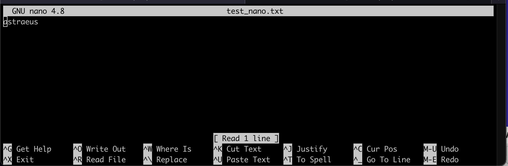
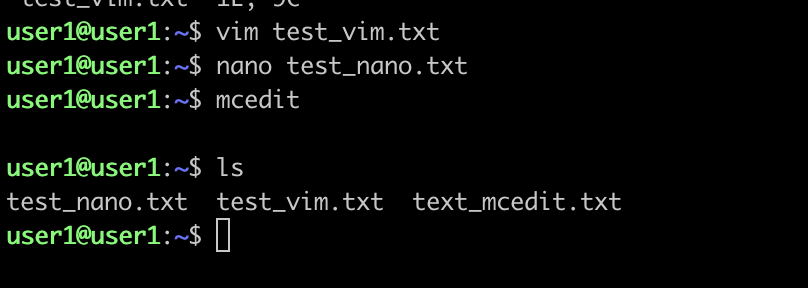
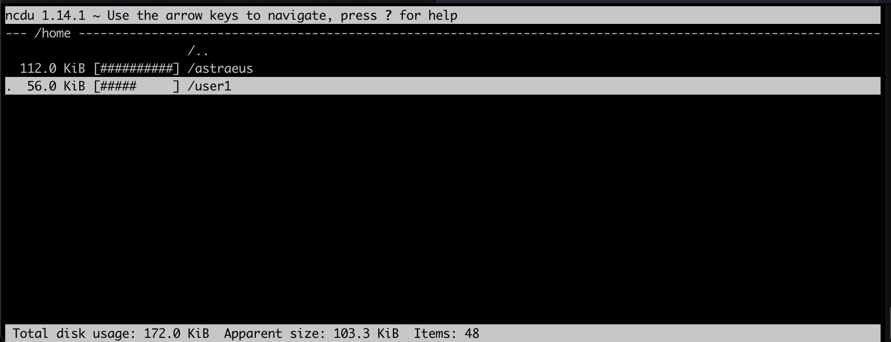

# Операционные системы UNIX/Linux (Базовый).

> При старте работы над проектом просим вас постараться хронометрировать время работы над проектом.
> По завершении работы над проектом просим вас ответить на два вопроса [в этом опросе](https://forms.gle/kheFQ1M3D27UeyeC9)

Установка и обновления системы Linux. Основы администрирования.


## Contents

1. [Chapter III](#chapter-iii) \
    1. [Установка ОС](#part-1-установка-ос)  
    2. [Создание пользователя](#part-2-создание-пользователя)  
    3. [Настройка сети ОС](#part-3-настройка-сети-ос)   
    4. [Обновление ОС](#part-4-обновление-ос)  
    5. [Использование команды  sudo](#part-5-использование-команды-sudo)  
    6. [Установка и настройка службы времени](#part-6-установка-и-настройка-службы-времени)  
    7. [Установка и использование текстовых редакторов](#part-7-установка-и-использование-текстовых-редакторов)  
    8. [Установка и базовая настройка сервиса SSHD](#part-8-установка-и-базовая-настройка-сервиса-sshd)   
    9. [Установка и использование утилит top, htop](#part-9-установка-и-использование-утилит-top-htop)   
    10. [Использование утилиты fdisk](#part-10-использование-утилиты-fdisk)   
    11. [Использование утилиты df](#part-11-использование-утилиты-df)    
    12. [Использование утилиты du](#part-12-использование-утилиты-du)    
    13. [Установка и использование утилиты ncdu](#part-13-установка-и-использование-утилиты-ncdu)    
    14. [Работа с системными журналами](#part-14-работа-с-системными-журналами)     
    15. [Использование планировщика заданий CRON](#part-15-использование-планировщика-заданий-cron)    


## Chapter I


## Part 1. Установка ОС


Вывод результата `cat /etc/issue.`

## Part 2. Создание пользователя


#### Создание пользователя


#### Вывод # `cat /etc/passwd`


#### Proof /var/log

## Part 3. Настройка сети ОС


#### Hostname установил имя машины user-1


#### Временная зона


#### Названия сетевых интерфейсов

* lo - это локальный хост, который не принадлежит ни к какой сети. Только себе так сказать=))
* 127.0.0.1 или localhost
* Доступен локально, предназначен для проверки работы служб


#### DHCP - Dynamic Host Configuration Protocol


#### Внешний ip и ip шлюза gateway (gw)


### Static Configure


#### Статичные данные, конфигурация и проверка работоспособности сети


#### PING 1.1.1.1 and ya.ru


## Part 4. Обновление ОС


#### Update system `apt update && apt dist-upgrade -y`
Флаг -y отвечает за автоматическое принятие/соглашение с системой

#### Заключительная проверка


## Part 5. Использование команды **sudo**


#### Proof sudo

* Sudo - предназначен для полученя root прав. Опасно использовать и запускать неизвестные файлы


## Part 6. Установка и настройка службы времени

#### Time Zone. Часовой пояс

## Part 7. Установка и использование текстовых редакторов 
* Были использованы редакторы Nano, VIM, MCEDIT
####  Создание и ввод запииси


* Edit with VIM
#### ДО

#### После


* Edit with Nano



* Edit with MCEDIT


##### Result text 


**== Search ==**
* Nano


#### CTRL + W - Text // Search
#### CTRL + \\ - Text and Replace // Reaplce

* VIM


#### /search text
#### s/text/replace/g

* MCEDIT


#### Потыкал кнопки прям там, на скриншоте видны

**== Result ==**


## Part 8. Установка и базовая настройка сервиса **SSHD**

* Install and autostart SshD


#### Change Port 


#### там проброс портов на уровне VB сделан и подключаюсь по 3022


#### Ps and netstat listen


* Netstat -tan 
  1. t - tcp
  2. a - all socket
  3. n - вывод вместо адресов ip
* PS -fC 
  1. f - full format
  2. C - command name

### 0.0.0.0/0 Все ip и все порты. Органичений нет

## Part 9. Установка и использование утилит **top**, **htop**


  1. uptime - 11 min
  2. количество авторизованных пользователей - 2
  3. общую загрузку системы - 0.00
  4. общее количество процессов - 100
  5. загрузку cpu - 0.0
  6. загрузку памяти - 329.2
  7. pid процесса занимающего больше всего памяти - 654 (скрин ниже)
  8. pid процесса, занимающего больше всего процессорного времени - 1275 (скрин ниже)

#### PID Memory


#### PID CPU


### HTOP

1. 
2. 
3. 
4. 
5. 
6. 
7. 

## Part 10. Использование утилиты **fdisk**

```text
Disk /dev/sda: 10 GiB, 10737418240 bytes, 20971520 sectors
Disk model: VBOX HARDDISK
Units: sectors of 1 * 512 = 512 bytes
Sector size (logical/physical): 512 bytes / 512 bytes
I/O size (minimum/optimal): 512 bytes / 512 bytes
Disklabel type: gpt
Disk identifier: 56467903-2820-4F84-BEFD-3A86174DF5E4


 название жесткого диска - /dev/sda
 Размер - 10GiB
 Sectors - 20971520
```

#### Fdisk
 

#### Swap


## Part 11. Использование утилиты **df** 


```text
 du / 
размер раздела - 9336140
размер занятого пространства - 4403780
размер свободного пространства - 4438384
процент использования - 50 %

------
du -Th

размер раздела - 9.0G
размер занятого пространства - 4.2G
размер свободного пространства - 4.3G
процент использования - 50% 
```

## Part 12. Использование утилиты **du**


#### Все в одном скрине


## Part 13. Установка и использование утилиты **ncdu**

* /home


* /var


* /var-log


* ncdu install 


## Part 14. Работа с системными журналами

#### Время успешной авторизации Jun 13 21:02:03  authority=local


#### Log Restart SshD


## Part 15. Использование планировщика заданий **CRON**

#### Syslog


#### Task


#### List Task


#### Del Task Cron


