# Simple Docker

> При старте работы над проектом просим вас постараться хронометрировать время работы над проектом.
> По завершении работы над проектом просим вас ответить на два вопроса [в этом опросе](https://forms.gle/6qcQSqdQnf7JD1iEA)

Введение в докер. Разработка простого докер образа для собственного сервера.


## Contents

1. [Chapter I](#chapter-i)
2. [Chapter II](#chapter-ii) \
    2.1. [nginx](#nginx) \
    2.2. [Docker](#docker) \
    2.3. [Dockle](#dockle)
3. [Chapter III](#chapter-iii) \
    3.1. [Готовый докер](#part-1-готовый-докер) \
    3.2. [Операции с контейнером](#part-2-операции-с-контейнером) \
    3.3. [Мини веб-сервер](#part-3-мини-веб-сервер) \
    3.4. [Свой докер](#part-4-свой-докер) \
    3.5. [Dockle](#part-5-dockle) \
    3.6. [Базовый Docker Compose](#part-6-базовый-docker-compose)


## Part 1. Готовый докер


**== Результат ==**

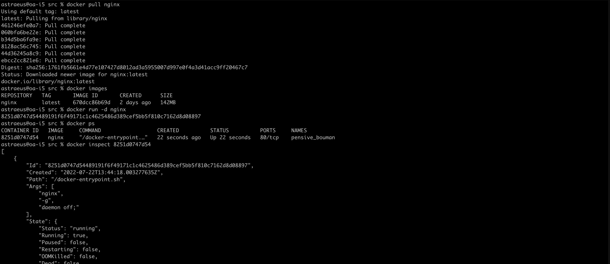
##### docker command create image
```
IP addr = 172.17.0.2
Size = 142MB
Port = 80/tcp
```

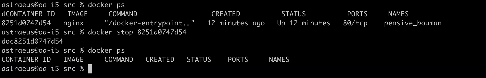
#### docker stop && docker ps

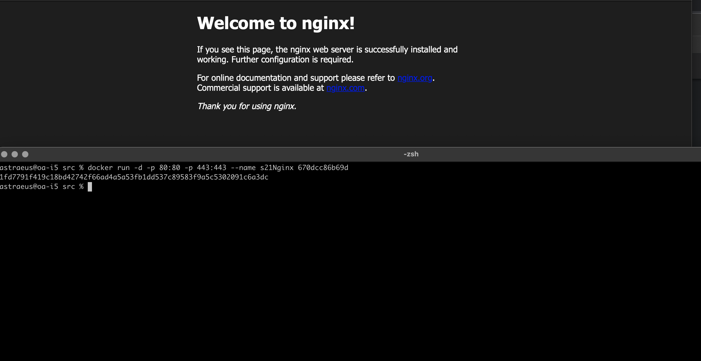
#### Run Docker with port 80 and 443
#### And Check localhost:80


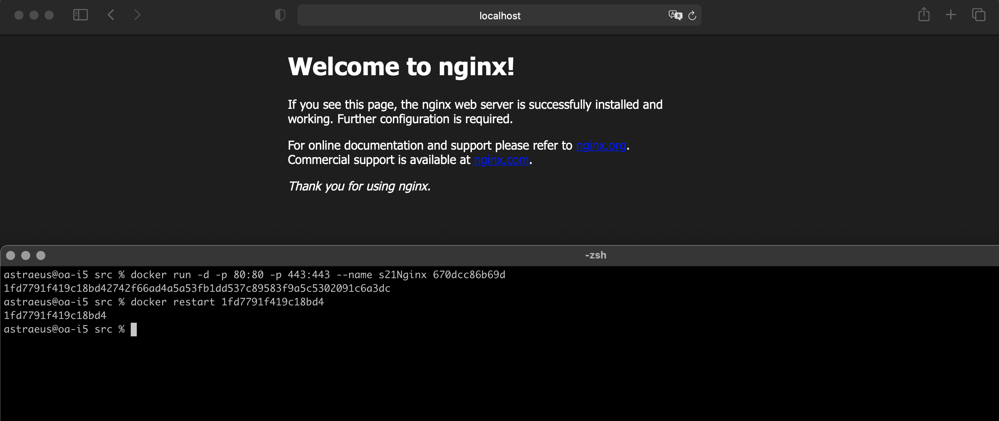
#### Restart Docker and check localhost:80
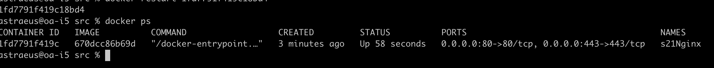
#### Check docker run

## Part 2. Операции с контейнером

Докер образ и контейнер готовы. Теперь можно покопаться в конфигурации **nginx** и отобразить статус страницы.


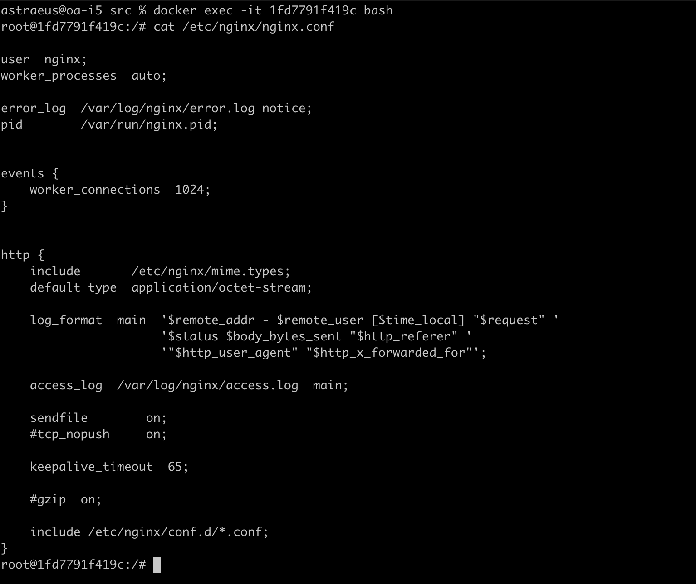
#### check nginx.conf with exec command

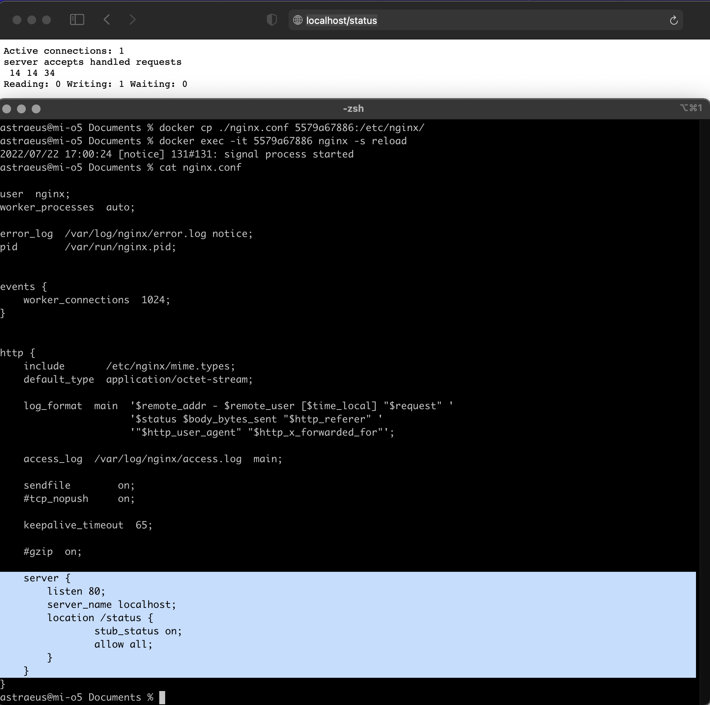
#### localhost/status and copy nginx.conf with settings 


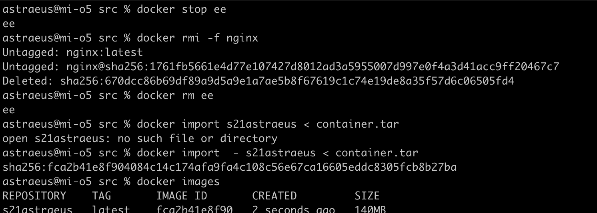
##### Import container with *import*


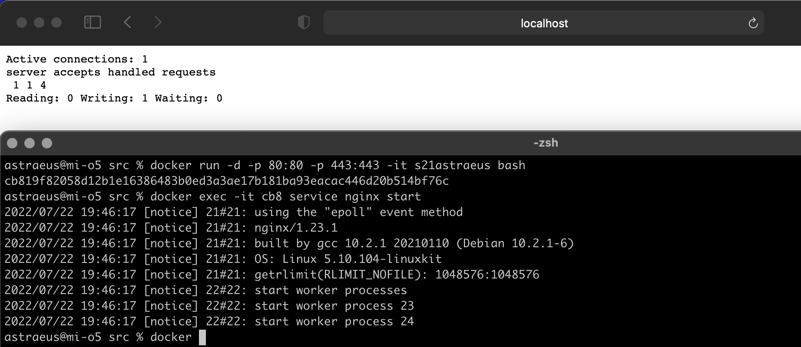
##### Run nginx and check localhost/status

## Part 3. Мини веб-сервер

Настало время немного оторваться от докера, чтобы подготовиться к последнему этапу. Настало время написать свой сервер.

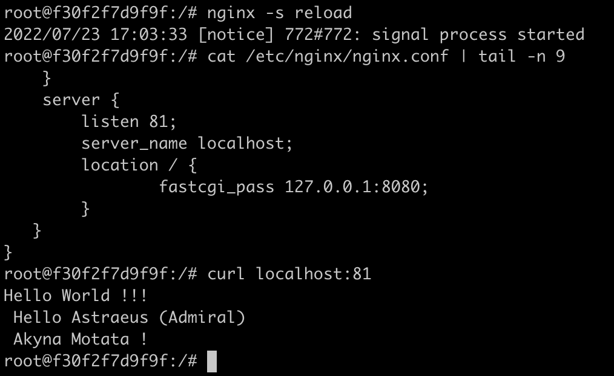
#### KyKy | check localhost

## Part 4. Свой докер

Теперь всё готово. Можно приступать к написанию докер образа для созданного сервера.

**== Задание ==**

*При написании докер образа избегайте множественных вызовов команд RUN*


#### Dockerfile


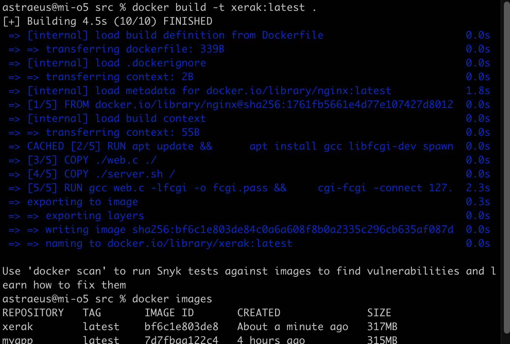
#### Docker images and build

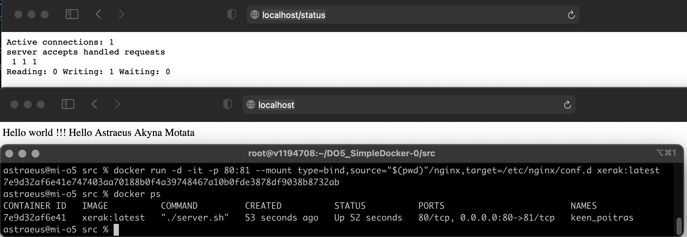
##### Mapping port and directory and check localhost


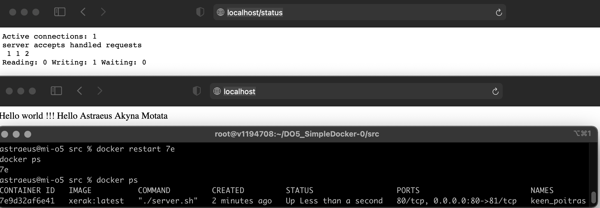
#### Restart Docker

## Part 5. **Dockle**

После написания образа никогда не будет лишним проверить его на безопасность.

#### Dockle исправлен, есть dockle.sh для запуска 

## Part 6. Базовый **Docker Compose**

Вот вы и закончили вашу разминку. А хотя погодите...
Почему бы не поэкспериментировать с развёртыванием проекта, состоящего сразу из нескольких докер образов?

**== Задание ==**

##### Написать файл *docker-compose.yml*, с помощью которого:
##### 1) Поднять докер контейнер из [Части 5](#part-5-инструмент-dockle) _(он должен работать в локальной сети, т.е. не нужно использовать инструкцию **EXPOSE** и мапить порты на локальную машину)_
##### 2) Поднять докер контейнер с **nginx**, который будет проксировать все запросы с 8080 порта на 81 порт первого контейнера
##### Замапить 8080 порт второго контейнера на 80 порт локальной машины

##### Остановить все запущенные контейнеры
##### Собрать и запустить проект с помощью команд `docker-compose build` и `docker-compose up`
##### Проверить, что в браузере по *localhost:80* отдается написанная вами страничка, как и ранее
